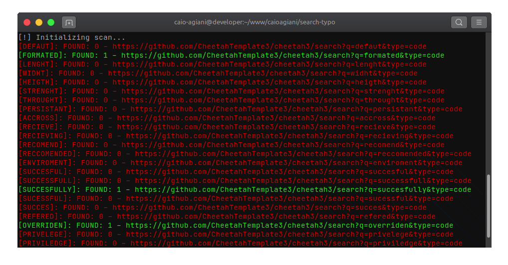

<!--
/*
 * Thanks for downloading this project, if you have any ideas, tweaks, etc...
 * fork the repository and create a Pull Request.
 */
-->

# Github Typos Scan


Simple tool to look for typos in github repositories



## Installation

```bash
# Download project
$ git clone git@github.com:caioagiani/github-typos-scan.git

# Join folder
$ cd github-typos-scan

# Install dependencies
$ yarn install or npm install

# Start application
$ yarn start or npm run start
```

## Usage

```js
(async () => {
  const urlRepository = "Github Repository"; // https://github.com/CheetahTemplate3/cheetah3

  await client.init();

  for (const word of enUs) {
    await client.github(urlRepository, word);
  }

  client.close();
})();
```

## License

Copyright © 2021 [caioagiani](https://github.com/caioagiani).<br />
Este projeto é licenciado [GNU AGPL](https://github.com/caioagiani/github-typos-scan/blob/master/LICENSE).
